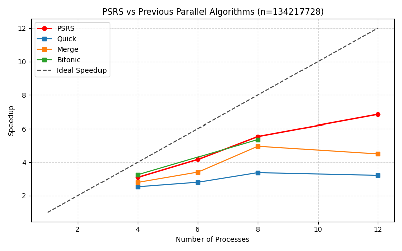
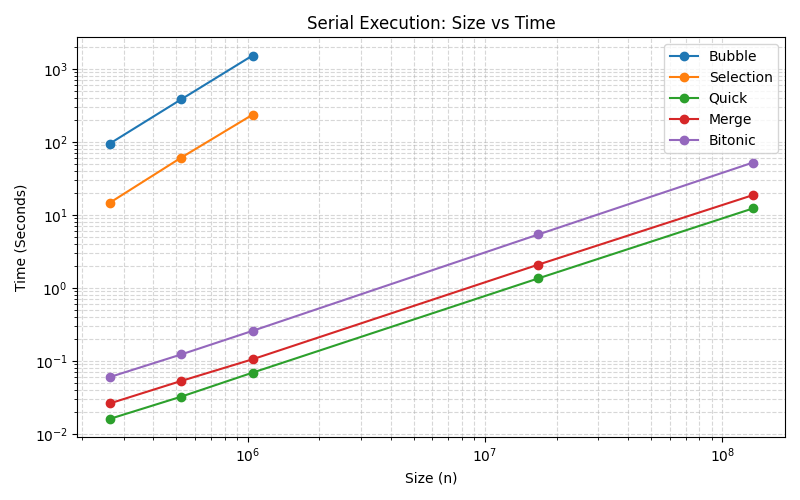
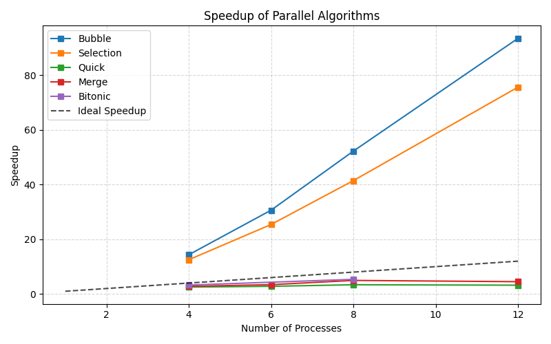

# High Performance Computing

Exploring parallel programming with MPI and CUDA. Mostly benchmarking how much faster things get when you throw more cores at a problem.



## Structure

```
openmpi/
├── intro-to-openmpi/     # MPI basics: hello world, scatter/gather, broadcast, reduce, pi
└── sorting-algorithms/
    ├── src/              # C sources + Python visualizer
    └── output/           # benchmark data (CSV) and plots (PNG)
cuda/
└── intro-to-cuda/        # CUDA basics: hello world, vector add
```

## Sorting Algorithms

Five sorting algorithms benchmarked in both serial and parallel (MPI) modes on an Intel Core i5-12400F:
bubble, selection, quicksort, merge sort, and bitonic sort.

Two parallel approaches are included. `parallel.c` does dynamic scatter + tree reduction merge simple, but rank 0 ends up doing a big O(n) sequential merge at the end. `psrs.c` fixes that with **Parallel Regular Sampling Sort**: processes negotiate splitters, redistribute data all-to-all, and each one independently sorts its own slice. No bottleneck.





Bubble and selection cross the ideal line because they are O(n²). Splitting n elements across p ranks cuts the work per rank to (n/p)², so the total work already drops by a factor of p before any parallelism is counted. The O(n log n) algorithms are the honest comparison.

### Build

From `sorting-algorithms/`:
```bash
make                       # all variants
make build/parallel-quick  # just one
make clean
```

Binaries go to `build/`, named by algorithm: `serial-quick`, `parallel-bubble`, and so on for `bubble`, `selection`, `quick`, `merge`, `bitonic`. PSRS has no variants, it is just `build/psrs`.

### Run

```bash
./build/serial-quick 134217728
mpiexec -np 8 ./build/parallel-quick 134217728
mpiexec --use-hwthread-cpus -np 12 ./build/psrs 134217728
```

### Visualize

```bash
cd src && python3 visualize.py
```

Reads `../output/data.csv`, writes `execution.png`, `speedup.png`, and `psrs_comparison.png` to `../output/`.

## CUDA

From `cuda/intro-to-cuda/`:
```bash
make
./build/hello_world
./build/vector_add
```

## Highlights

- Quicksort scales the best of the tree-reduction group: 12 cores cuts 12s down to ~3.8s
- PSRS does better: same 12 cores gets to ~1.8s (6.8x speedup vs 3.2x for tree reduction)
- Bubble sort is painful at any scale (1517s serial on 1M elements)
